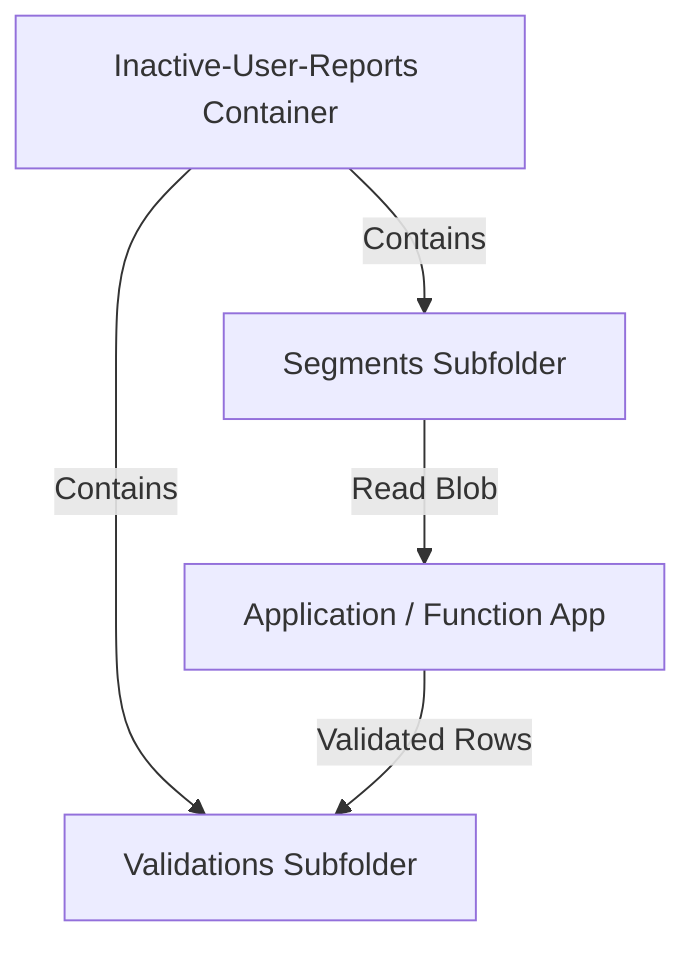

```mermaid
graph TD;
  B[Inactive-User-Reports Container] -->|Contains| C[Segments Subfolder]
  C -->|Read Blob| A[Application / Function App]
  B -->|Contains| D[Validations Subfolder]
  A -->|Validated Rows| D


```

