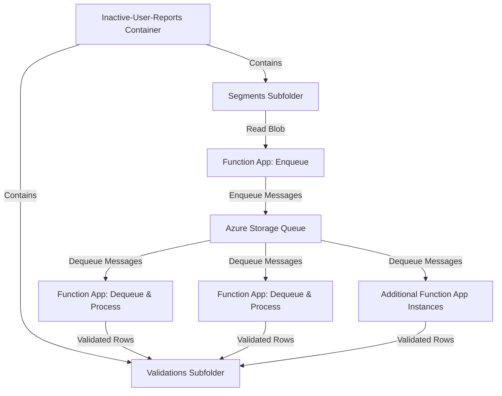

```mermaid

graph TD;
  B[Inactive-User-Reports Container] -->|Contains| C[Segments Subfolder]
  C -->|Read Blob| A[Function App: Enqueue]
  A -->|Enqueue Messages| Q[Azure Storage Queue]
  Q -->|Dequeue Messages| D[Function App: Dequeue & Process]
  Q -->|Dequeue Messages| E[Function App: Dequeue & Process]
  Q -->|Dequeue Messages| F[Additional Function App Instances]
  B -->|Contains| G[Validations Subfolder]
  D -->|Validated Rows| G
  E -->|Validated Rows| G
  F -->|Validated Rows| G

```